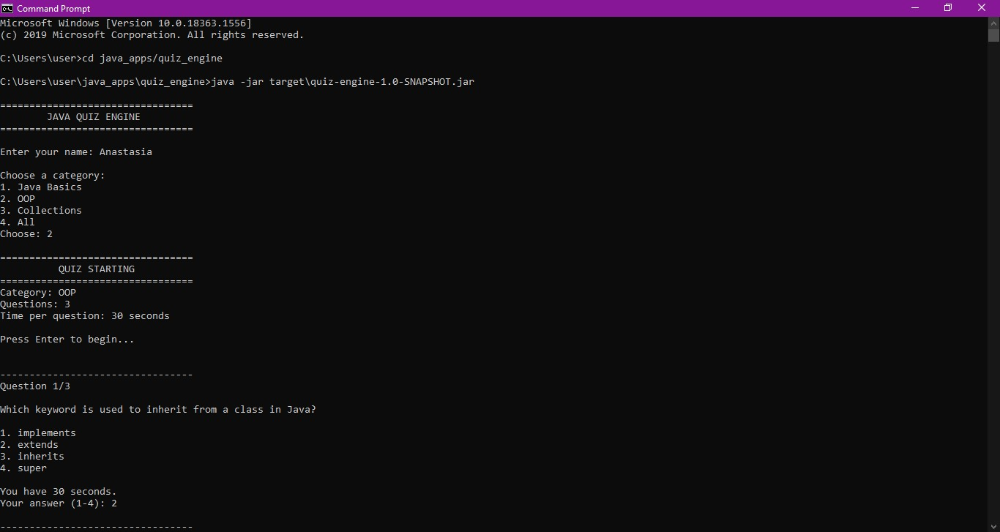
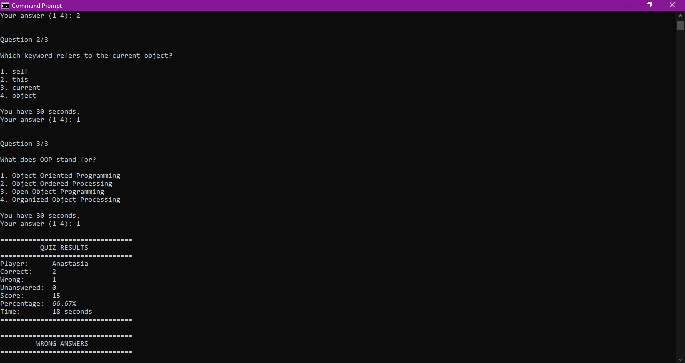
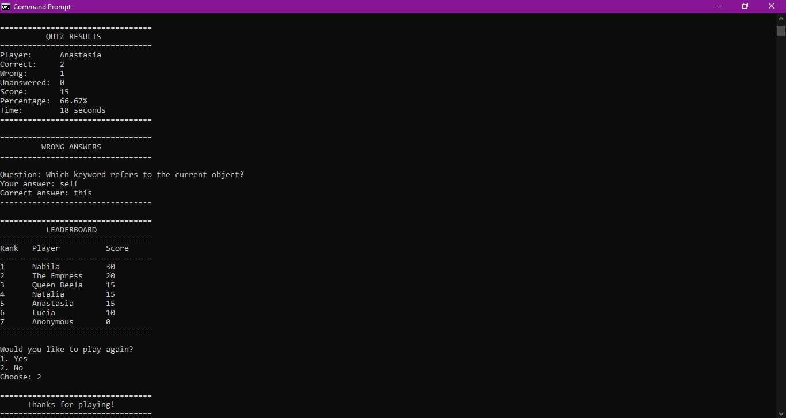

# Java Quiz Engine

This is my final project for my backend internship.

A console-based quiz engine built with **Java 17** and **Maven**.

The application loads multiple-choice questions from a JSON question bank, allows users to take timed quizzes, calculates scores with negative marking, reviews incorrect answers, and maintains a persistent local leaderboard.

---

## SCREENSHOTS

---

## Technologies Used

| Technology | Purpose |
|---|---|
| Java 17 | Main programming language |
| Maven | Build and dependency management |
| Gson | Reading JSON question banks |
| JUnit 5 | Automated testing |
| CSV | Local leaderboard storage |

---

## Features

### Core Features

- Multiple-choice questions (MCQs)
- Questions loaded from a JSON file
- Category filtering
- Randomised questions
- Timed quiz attempts
- Automatic score calculation
- Positive marking
- Negative marking
- Unanswered question tracking
- Review of wrong answers
- Persistent local leaderboard
- Progress feedback
- Input validation
- Error handling for malformed question banks
- Timer edge-case handling
- JUnit 5 tests
- Maven project management

---

## Project Structure

quiz_engine/
│
├── pom.xml
├── README.md
│
├── src/
│   │
│   ├── main/
│   │   │
│   │   ├── java/
│   │   │   └── com/
│   │   │       └── quizengine/
│   │   │           │
│   │   │           ├── Main.java
│   │   │           │
│   │   │           ├── model/
│   │   │           │   ├── AnswerReview.java
│   │   │           │   ├── LeaderboardEntry.java
│   │   │           │   ├── Question.java
│   │   │           │   └── QuizResult.java
│   │   │           │
│   │   │           ├── service/
│   │   │           │   ├── LeaderboardService.java
│   │   │           │   ├── QuizService.java
│   │   │           │   └── ScoreService.java
│   │   │           │
│   │   │           ├── storage/
│   │   │           │   ├── LeaderboardStorage.java
│   │   │           │   └── QuestionBank.java
│   │   │           │
│   │   │           └── util/
│   │   │               └── TimedInput.java
│   │   │
│   │   └── resources/
│   │       └── questions.json
│   │
│   └── test/
│       │
│       └── java/
│           └── com/
│               └── quizengine/
│                   │
│                   ├── LeaderboardServiceTest.java
│                   ├── QuestionBankTest.java
│                   └── ScoreServiceTest.java
│
└── target/
    |
    └── classes 
    └── generated-sources
    └── generated-test-sources
    └── maven-status
    └── surefire-reports
    └── test-classes

## Getting Started
### Prerequisites

Make sure you have:

Java 17 or later
Maven

A terminal or command prompt

Check Java:

java -version

Check Maven:

mvn -version

The project is configured to compile against Java 17.

### Installation

Clone or download the project.

Navigate into the project directory

Install dependencies and compile:
mvn clean install

Running Tests

Run the complete test suite:

mvn test

A successful test run should display:
BUILD SUCCESS

The project uses JUnit 5 for automated testing.

Current tests cover areas such as:

Score calculation
Negative marking
Invalid score input
Leaderboard functionality
Question bank loading
Malformed JSON handling
Invalid question data
Running the Application

First compile the project:

mvn clean package

Then run the application using Java.

Depending on your Maven configuration, you can run:

java -cp target/classes com.quizengine.Main

If Gson is required at runtime through the classpath, use Maven's dependency classpath or configure the Maven Exec Plugin.

### Question Bank

Questions are stored in:

src/main/resources/questions.json

The application expects questions in JSON format.

Example:

[
  {
    "question": "What does JVM stand for?",
    
    "options": [
    
      "Java Variable Machine",
    
      "Java Virtual Machine",
    
      "Java Visual Machine",
    
      "Java Verified Machine"
    ],
    
    "correctAnswerIndex": 1,
    
    "category": "Java"
  },
  {
    "question": "Which keyword is used to create a class in Java?",
  
    "options": [
  
      "class",
  
      "struct",
  
      "object",
  
      "new"
    ],
  
    "correctAnswerIndex": 0,
  
    "category": "Java"
  }
]

#### Question Requirements

##### Every question must contain:

A question

A category

Exactly four options

A valid correct answer index

The correct answer index is zero-based.

For example:

0 = first option

1 = second option

2 = third option

3 = fourth option

### Quiz Flow

The application follows a basic quiz flow:

Start Application
       ↓

Load Question Bank
       ↓

Select Category
       ↓

Randomise Questions
       ↓

Start Timer
       ↓

Answer Questions
       ↓

Calculate Score
       ↓

Display Results
       ↓

Review Wrong Answers
       ↓

Save Result
       ↓

Update Leaderboard

### Timed Questions / Quiz

The application uses TimedInput to limit the amount of time available for answering questions.

If the timer expires before an answer is entered, the question can be treated as unanswered.

The timer also handles edge cases such as:

Zero or negative timeout values
Interrupted input
Input-reading errors
Executor shutdown

### Scoring System

The scoring system supports both positive points and negative marking.

The formula is:

Score = (Correct × Correct Points)
        - (Wrong × Wrong Penalty)

The final score cannot fall below zero.

For example:

Correct answers = 8
Wrong answers   = 2
Correct points  = 10
Wrong penalty   = 2

Calculation:

(8 × 10) - (2 × 2)

= 80 - 4

= 76

### Wrong Answer Review

After completing a quiz, users can review incorrect answers.

Each wrong answer stores:

The original question

The selected answer

Whether the answer was correct

This functionality is represented by:

AnswerReview

### Leaderboard

The quiz engine maintains a local leaderboard.

Leaderboard records contain:

Player name

Score

Correct answers

Wrong answers

Unanswered questions

Percentage

Example CSV structure:

player,score,correct,wrong,unanswered,percentage

Nabila,80,8,1,1,80.00

John,70,7,2,1,70.00

Mary,60,6,3,1,60.00

The leaderboard is stored locally rather than requiring an external database.

### Data Storage

The project currently uses:

#### JSON

Used for the question bank:

src/main/resources/questions.json

#### CSV

Used for persistent leaderboard data.

### Main Components
#### Main.java

The main entry point of the application.

It is responsible for starting the quiz application and coordinating the major application flow.

#### Question.java

Represents an individual quiz question.

A question contains:

question
options
correctAnswerIndex
category

#### QuizResult.java

Stores the result of a completed quiz.

It contains:

correct
wrong
unanswered
score
totalQuestions
elapsedSeconds
wrongAnswers
AnswerReview.java

Represents a user's answer to a question and whether the answer was correct.

#### QuestionBank.java

Responsible for loading and validating questions from JSON.

It handles:

Missing question bank

Empty question bank

Malformed JSON

Missing question text

Missing categories

Incorrect number of options

Invalid correct-answer indexes

#### QuizService.java

Handles quiz-related logic such as:

Filtering questions by category

Randomising questions

Calculating quiz results

Tracking correct answers

Tracking wrong answers

Tracking unanswered questions

ScoreService.java

Handles scoring rules.

Example:

ScoreService scoreService =
        new ScoreService(10, 2);

This means:

Correct answer = +10 points
Wrong answer   = -2 points
LeaderboardService.java

Handles leaderboard-related operations.

It works with the leaderboard storage layer to:

Load leaderboard entries
Add new results
Sort rankings
Save rankings
LeaderboardStorage.java

Handles reading and writing leaderboard data to a local CSV file.

#### TimedInput.java

Provides timed console input.

It uses Java's concurrency utilities to wait for user input for a specified amount of time.

### Testing

The project uses JUnit 5.

Tests are located inside:

src/test/java/com/quizengine/

Current test classes include:

ScoreServiceTest.java
LeaderboardServiceTest.java
QuestionBankTest.java

Run all tests with:

mvn test

### Error Handling

The application includes validation for common errors.

Missing Question Bank

If the question file does not exist, the application reports an error instead of silently continuing.

Empty Question Bank

An empty JSON file is rejected.

Malformed JSON

Invalid JSON produces a meaningful error.

Invalid Questions

Questions are rejected when:

Question text is missing
Category is missing
There are not exactly four options
Correct answer index is invalid
Invalid Scoring Configuration

The scoring service rejects negative scoring configuration values.

### Question Randomisation

Questions are shuffled before the quiz begins.

This prevents the quiz from always presenting questions in the same order.

Category filtering is also supported.

For example:

All
Java
Programming
Web Development
Databases

### Progress Feedback

During a quiz, the application can provide feedback such as:

Question 3 of 10

This allows the user to know how much of the quiz they have completed.

### Maven Commands (Examples)

#### Clean the project:

mvn clean

#### Compile:

mvn compile

#### Run tests:

mvn test

#### Package the application:

mvn package

#### Clean and build:

mvn clean package

#### Clean, test, and install:

mvn clean install